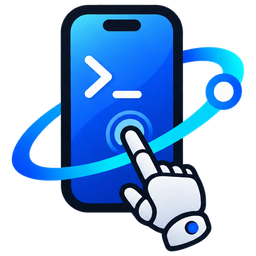

# SimGadget — iOS simulator automation for JS/TS and MCP

SimGadget boots simulators, reads the accessibility tree, and taps controls by
name — from TypeScript, or from any AI agent that speaks MCP. No Python, no
Homebrew, no four-year-old tooling.

## System requirements

- **macOS on Apple Silicon.** iOS simulators are macOS-only and the pinned
  companion is arm64-only.
- **Xcode**, with at least one iOS runtime installed.
- **Node.js 18+.**

## The two packages

| Package | Install | For |
|---|---|---|
| [`simgadget`](https://www.npmjs.com/package/simgadget) | `npm install simgadget` | Driving a simulator from your own JS/TS — tests, scripts, tooling |
| [`simgadget-mcp`](https://www.npmjs.com/package/simgadget-mcp) | `npx -y simgadget-mcp` | An MCP server so AI agents can drive simulators |

The server is built on the library and imports only its public API. Both are
published in lockstep at the same version number, so there is never any version
skew to reason about.

## No idb, no separate idb_companion install needed

You don't need to install the python `idb` cli, nor `idb_companion` -- If you've
used libraries or MCPs that drive iOS simulators before you're already
happier having read that.

Facebook's last `idb` release was **2022**. Anyone writing an iOS-simulator 
library in JS today either shells out to that four-year-old code.

SimGadget pins its own: a companion built from **current idb source** against
Xcode 26.6 / Swift 6.3.3, published as a release asset, sha256-verified, and
downloaded on demand the first time you need it (~19 MB, cached afterwards).
That is what makes tapping by name possible, and what makes a tap that would
miss say so instead of reporting success.


---

# The library

```bash
npm install simgadget
```

```js
import { createSimulator } from "simgadget";

// Creates on the latest installed iOS runtime and waits until the device is
// actually driveable — `simctl boot` returns a minute before accessibility
// answers. Does not throw on a slow boot; ask the handle how it went.
const sim = await createSimulator({ deviceType: "iPhone 16 Pro" });
console.log(sim.udid, sim.lastBoot); // { ready: true, waitedMs: 41000, ... }

await sim.installApp("./build/MyApp.app");
await sim.launchApp("com.example.myapp"); // -> { pid: 18900 }

// Resolve the element, refuse it if disabled or covered, then touch it.
const result = await sim.tap({ label: "Sign Up" });
// { acted: "touch", x: 201, y: 442, count: 1, durationSeconds: 0.1, element: {...} }

await sim.tap({ label: "Email" });
await sim.typeText("test@example.com");

// null is the ordinary "not on screen" answer, not an error.
const banner = await sim.findByLabel("Welcome back");

await sim.screenshot({ path: "/tmp/signup.png" });
await sim.delete();
```

CommonJS works the same way: `const { createSimulator } = require("simgadget")`.

## What it gives you

- **`createSimulator` / `attachSimulator` / `listSimulators`** — lifecycle over
  `simctl`, with a boot that waits until the device answers rather than until
  `simctl` returns.
- **A `Simulator` handle** per simulator: `describeScreen`, `findByLabel`,
  `findByIdentifier`, `describePoint`, `tap`, `typeText`, `swipe`,
  `pressButton`, `rotate`, `detectOrientation`, `screenshot`,
  `startRecording`/`stopRecording`, `installApp`, `launchApp`, plus
  `boot`/`waitReady`/`showWindow`/`shutdown`/`delete`.
- **Typed errors.** Every failure you can act on is a `SimGadgetError` with a
  `code` and a payload — `element-not-found`, `tap-obstructed` (carrying what
  was in the way), `element-disabled`, `untypeable-text`, `not-answering`,
  `simulator-not-found`, and the rest. Nothing regexes a message.
- **Results, not success strings.** `tap()` answers with what it did: a real
  touch at named coordinates, or an accessibility activation with the toggle
  state read back before and after. When it cannot confirm the state changed it
  says so rather than claiming success.

The full API, with every signature, result shape and error payload, is in
[SIMGADGET.md](SIMGADGET.md).


---

# The MCP server

An MCP server that lets AI agents create, control, and destroy iOS simulators
through session-based lifecycle management. Each session owns its own simulator,
so multiple agents work in parallel without conflicts.

```
┌──────────────┐  ┌──────────────┐  ┌──────────────┐
│   Agent A    │  │   Agent B    │  │   Agent C    │
│  (id: "qa1") │  │  (id: "qa2") │  │  (id: "dev") │
└──────┬───────┘  └──────┬───────┘  └──────┬───────┘
       │                 │                 │
       └────────────┬────┴────┬────────────┘
                    │         │
              ┌─────┴─────────┴──────┐
              │    MCP Server        │
              │  (single process)    │
              └──┬─────────┬──────┬──┘
                 │         │      │
          ┌──────┴──┐ ┌────┴───┐ ┌┴────────┐
          │ iPhone  │ │ iPad   │ │ iPhone  │
          │ 16 Pro  │ │ Air    │ │ 16 Pro  │
          │ (qa1)   │ │ (qa2)  │ │ (dev)   │
          └─────────┘ └────────┘ └─────────┘
```

## Installation

HTTP is the default transport, because sessions live in the server process and
that is what lets several agents share it. Start the server:

```bash
npx -y simgadget-mcp --port 54321
```

**Then point your agent at it.**

**Claude Code:**

```bash
claude mcp add --transport http simgadget http://localhost:54321/mcp
```

**Cursor and other config-file clients** (`~/.cursor/mcp.json`):

```json
{
  "mcpServers": {
    "simgadget": {
      "type": "http",
      "url": "http://127.0.0.1:54321/mcp"
    }
  }
}
```

> **Security note:** the HTTP transport is unauthenticated and binds to
> `127.0.0.1` by default. Do not expose the port to untrusted networks — the
> server can create and control simulators, read screenshots, and write files.
>
> Requests are checked against an allowlist of `Host` headers, which stops a web
> page you happen to visit from pointing a hostname it controls at `127.0.0.1`
> and driving the server from your browser. If you deliberately reach the server
> by another name, add it to `SIMGADGET_ALLOWED_HOSTS`. A rejected request says
> so, lists what is accepted, and names that variable.

### Running the client in a container

The simulators live on the host — a container cannot run them — so the usual
shape is the server on the host and the client inside the container, reaching
out through Docker's host alias:

```bash
# on the host: listen where the container can reach it
npx -y simgadget-mcp --host 0.0.0.0 --port 8008
```

```json
{ "mcpServers": { "simgadget": {
  "type": "http", "url": "http://host.docker.internal:8008/mcp"
} } }
```

`host.docker.internal`, `gateway.docker.internal` and Podman's
`host.containers.internal` are accepted by default. Any other name — a proxy, a
LAN address, a hostname of your own — needs
`SIMGADGET_ALLOWED_HOSTS="that.name:8008"`.

Binding to `0.0.0.0` exposes an unauthenticated server to every network the host
is on, so do it only on a machine you trust, and prefer publishing the port to
the container alone where your setup allows it.

### Stdio mode

Add `--stdio` if you want the old shape, where the client spawns its own private
server. Note that you lose multi-agent support: sessions live in the server
process, and with stdio every client has a different one.

```json
{
  "mcpServers": {
    "simgadget": {
      "command": "npx",
      "args": ["-y", "simgadget-mcp", "--stdio"]
    }
  }
}
```

## Example usage

The tool descriptions are usually enough for an agent to drive this, but
[AGENT_INSTRUCTIONS.md](AGENT_INSTRUCTIONS.md) can be handed over for more
concrete examples.

Each agent picks a distinct session `id` and passes it to every tool. Because
all state lives in the one shared server process, the simulator survives the
agent disconnecting; calling `start_simulator` again with the same `id` resumes
the existing simulator instead of creating a new one. Owned simulators are
destroyed when the server itself shuts down unless
`SIMGADGET_CLEANUP_ON_EXIT=false`.

**Launch an app and navigate:**

> Use simgadget to start an iPhone 16 Pro simulator, open Settings, and navigate to General > About.

**Compare a screenshot against expected state:**

> Take a screenshot of the simulator and check whether the login screen is showing
> the "Welcome back" message.

**Multi-step agent workflow (great for Haiku subagents):**

> You are a QA agent. Start a simulator, install the app at ./build/MyApp.app,
> launch it (com.example.myapp), then:
> 1. Tap "Sign Up"
> 2. Fill in the email field with "test@example.com" and password with "password123"
> 3. Tap "Submit"
> 4. Take a screenshot and verify the success message appears

**Pro Tip:** you can use cheap agents like Haiku to do navigation and even
visual comparison. You do not need Opus to navigate around your app, saving you
tons of money and time. Haiku is _almost_ fast enough that you can record demo
videos without speeding up ;)

## Driving the UI

There are two ways for an agent to act on the screen, and picking the right one
is most of the difference between a cheap agent loop and an expensive one.

### When you know what you want: `ui_tap` and `ui_find`

```
ui_tap  { id: "qa1", label: "Sign Up" }
ui_find { id: "qa1", label: "Welcome back" }
```

The simulator resolves the element itself and returns only the match — a few
hundred bytes, versus several kilobytes for a whole screen. `ui_tap` operates
that element, so the model never handles a coordinate. `ui_find` returns the
element without its subtree, and reports a miss as an ordinary answer rather
than an error.

Matching is a case-sensitive substring match against the element's accessibility
label, its visible text, or its accessibility identifier; curly quotes,
apostrophes and dashes are folded to their plain equivalents. The first match
wins, so name things precisely — `ui_tap` replies with the element it acted on,
which is where a wrong match shows up.

`ui_tap` checks the touch will reach the element before sending it, so a control
that is covered, scrolled out of view or disabled is **refused** rather than
silently missed. A switch is switched rather than touched — its accessibility
frame usually spans its whole row, so the centre is not the control — and the
reply carries the state read back:

```
Tapped "Toolbar Button" (Button) at (102, 822).
Toggled Sound off -> on.
"Plain Stepper, Increment" is at {x:201 y:794 w:140 h:32}, but "Toolbar Search"
is there instead, so a tap at its centre (271, 810) would not reach it — it is
covered, off screen, or scrolled out of view.
```

`ui_tap { x, y }` is always a plain touch, for when you want exactly that.

### When you need to look around: `ui_describe_all`

Use this when the agent doesn't yet know what is on screen. It returns a nested
JSON accessibility tree in logical coordinates, read from the app's real view
hierarchy — so nav bars, tab bars and toolbars have their contents — pruned to
elements you can act on.

### Seeing the screen: `ui_view`

`ui_view` returns a compressed screenshot, which is useful for *verifying* what
an app looks like. It is a poor choice for navigation: screenshots are in pixel
space while taps are in logical space, and the two do not line up once the
device is rotated. Navigate with labels or `ui_describe_all`; use `ui_view` to
check the result.

## Tools

All tools take a required `id` (session identifier) parameter.

| Tool | Additional Parameters | Description |
|------|----------------------|-------------|
| `start_simulator` | `type?` (e.g. "iPhone", "iPad", "iPhone 16 Pro") | Creates, boots, and opens a simulator for the session |
| `destroy_simulator` | — | Shuts down and deletes the session's simulator |
| `attach_simulator` | `udid` | Attaches to an existing booted simulator by UDID |
| `rotate` | `orientation` (`portrait`, `landscape_left`, `landscape_right`, `upside_down`) | Rotates the device, then reports the orientation the interface actually adopted |
| `detect_rotation` | — | Detects device rotation and updates coordinate mapping |
| `ui_find` | `label` | Finds one element by accessibility label, without fetching the screen |
| `ui_tap` | `label?`, `x?`, `y?`, `duration?`, `count?` | Operate an element by name, or tap at coordinates |
| `ui_describe_all` | — | Returns accessibility tree for the entire screen (JSON) |
| `ui_type` | `text` | Type text into the focused field |
| `ui_swipe` | `x_start`, `y_start`, `x_end`, `y_end`, `duration?`, `delta?` | Swipe gesture |
| `ui_describe_point` | `x`, `y` | Returns the accessibility element at a point |
| `ui_view` | — | Returns a compressed screenshot as base64 JPEG |
| `screenshot` | `output_path`, `type?`, `display?`, `mask?` | Saves a screenshot to a file |
| `record_video` | `output_path?`, `codec?`, `display?`, `mask?`, `force?` | Starts video recording |
| `stop_recording` | — | Stops the current recording |
| `install_app` | `app_path` | Installs a .app or .ipa on the simulator |
| `launch_app` | `bundle_id`, `terminate_running?` | Launches an app by bundle identifier |

---

# Configuration

## CLI flags

Server only. Flags take precedence over the equivalent environment variables:

| Flag | Equivalent env var |
|------|--------------------|
| `--http` / `--stdio` / `--transport <mode>` | `SIMGADGET_TRANSPORT` |
| `--host <addr>` | `SIMGADGET_HTTP_HOST` |
| `--port <n>` | `SIMGADGET_HTTP_PORT` |
| `--verbose` / `-v` | `SIMGADGET_VERBOSE` |

(Each value flag also accepts the `--flag=value` form.)

## Environment variables

Two are read by the **library** — and identically by the server, since it uses
the library to reach a companion. The other eight configure a **server** and
mean nothing to a library caller.

| Variable | Read by | Description | Example |
|----------|---------|-------------|---------|
| `SIMGADGET_COMPANION_PATH` | library | Custom path to the `idb_companion` binary, used verbatim and ahead of everything else | `~/idb/Build/Distribution/idb_companion` |
| `SIMGADGET_COMPANION_CACHE` | library | Cache root for the downloaded companion (default: `~/Library/Caches/simgadget`, or `$XDG_CACHE_HOME/simgadget` if set) | `~/.cache/simgadget` |
| `SIMGADGET_FILTERED_TOOLS` | server | Comma-separated list of tool names to hide | `screenshot,record_video` |
| `SIMGADGET_DEFAULT_OUTPUT_DIR` | server | Default directory for screenshots and recordings (default: `~/Downloads`) | `~/Code/project/tmp` |
| `SIMGADGET_TRANSPORT` | server | Transport to use: `http` (default) or `stdio` | `stdio` |
| `SIMGADGET_HTTP_HOST` | server | Bind address in HTTP mode (default: `127.0.0.1`) | `127.0.0.1` |
| `SIMGADGET_HTTP_PORT` | server | Listen port in HTTP mode (default: `8008`) | `8008` |
| `SIMGADGET_CLEANUP_ON_EXIT` | server | Destroy owned simulators when the server shuts down (default: `true`) | `false` |
| `SIMGADGET_VERBOSE` | server | Log client connections and tool calls to stderr in HTTP mode (default: `false`) | `true` |
| `SIMGADGET_ALLOWED_HOSTS` | server | Extra `host:port` values accepted in the HTTP `Host` header. Loopback and the container host aliases are accepted already; this is for a proxy, a LAN address, or a name of your own | `mac.local:8008` |

The former `IOS_SIMULATOR_MCP_*` spelling of each still works, with one
deprecation line on stderr per variable. That fallback goes away two releases
after the rename.

In HTTP mode these belong in the shell that starts the server, since that is the
process they configure — the client only holds a URL:

```bash
SIMGADGET_DEFAULT_OUTPUT_DIR=~/Code/project/tmp \
  npx -y simgadget-mcp --port 54321
```

In stdio mode, where the client spawns the server, set them in the `env` block
of your MCP client config instead.

## Verbose

`--verbose` shows clients connecting and their commands:

```
SimGadget MCP server listening on http://127.0.0.1:8008/mcp (verbose)
[2026-08-09T09:53:53.472Z] client 127.0.0.1:49630 connected
[2026-08-09T09:53:53.476Z] 127.0.0.1:49630 initialize
[2026-08-09T09:53:53.501Z] 127.0.0.1:49632 session "qa-a" start_simulator
[2026-08-09T09:53:54.900Z] 127.0.0.1:49632 session "qa-a" ui_tap
[2026-08-09T09:53:55.100Z] client 127.0.0.1:49630 disconnected
```

---

# How `idb_companion` is obtained

Both packages resolve the companion the same way, using the first they find:

1. **`SIMGADGET_COMPANION_PATH`**, if set — used verbatim.
2. **A locally built companion** at `vendor/idb/Build/Distribution/idb_companion`,
   if you have built the vendored idb submodule (see [CONTRIBUTING.md](CONTRIBUTING.md)).
3. **A downloaded companion**, pinned by URL and sha256 in
   `companion.lock.json`, verified against that hash and cached under
   `~/Library/Caches/simgadget/companion/<sha256>/` — so it downloads once.
4. **Otherwise it fails with a clear error.**

There is deliberately no fallback to an `idb_companion` on your `PATH`, including
a Homebrew one, which is simply ignored. An older companion silently ignores
request fields it does not understand rather than rejecting them, so falling back
would produce wrong-but-plausible results instead of a clean failure. Details in
[TROUBLESHOOTING.md](TROUBLESHOOTING.md).

# Troubleshooting

**Rotated screen** — screenshots are pixel space while taps use logical space,
so they don't align once rotated. Navigate with `ui_tap { label }` /
`sim.tap({label})` or a describe instead; both use logical coordinates, and both
cost fewer tokens anyway.

**"I asked for `landscape_left` and the app says `landscapeRight`"** — both are
right. UIKit has two orientation vocabularies and crosses them deliberately:
`UIInterfaceOrientationLandscapeLeft` *is* `UIDeviceOrientationLandscapeRight`,
"because rotating the device to the left requires rotating the content to the
right". `rotate` and `detect_rotation` name the **device**, the same way the
Simulator's own Device > Orientation menu does; an app reading its own
`interfaceOrientation` will report the mirror word for the two landscapes.

**`rotate: "upside_down"` appears to do nothing on an iPhone** — the device does
turn, but no Face ID iPhone gives an app an upside-down interface, whatever its
`Info.plist` says. `rotate` tells you so, and reports the orientation the
interface actually kept. Use an iPad if you need that case.

For everything else, see [TROUBLESHOOTING.md](TROUBLESHOOTING.md).

# License

MIT
